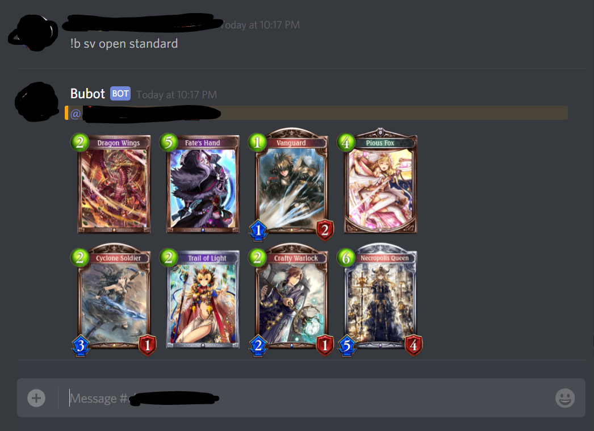
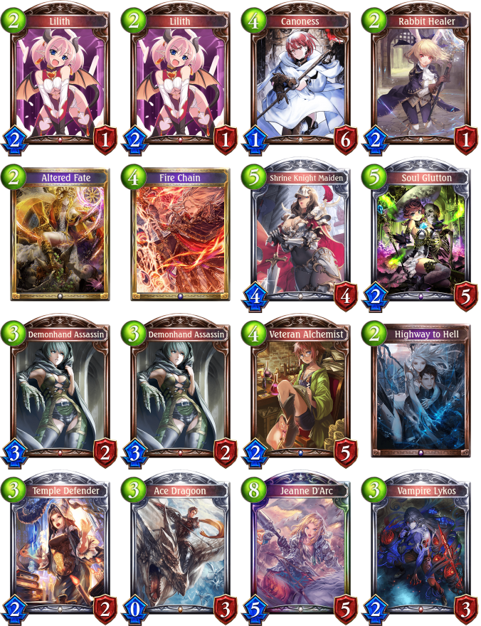

# Installation:

    1) Create an app on: https://discordapp.com/developers/applications/me
    
    2) Click 'Create a Bot User'
    
    3) Grab the bot's Client ID and put it in <INSERT HERE>: https://discordapp.com/oauth2/authorize?client_id=<INSERT HERE>&scope=bot&permissions=0
    
    4) Invite the bot to your channel by clicking the above link
    
    5) Clone the repo.

    6) Install HerokuCLI and create an account, then create an app app-name.

    7) Add a database to the app.

    8) In your CLI, use heroku login, cd BubuBot, heroku git:remote -a app-name, git push heroku master.

    9) Activate the app on the app page.

    10) For a list of commands, use the '!b help' command.

# Commands:
```
BaseCommands:
  changeplaying <gamename> *Admin
  test          Test command
  uptime        Prints out how long the bot has been online
Clear:
  clear         <number> *Admin
Games:
  answerme      <question> : 100% accuracy
Move:
  move          <userID> <channelID> *Admin
  moveme        <channelID> *Admin
Shadowverse:
  sv            Shadowverse extension manager
Voice:
  play          <url|keywords>
  skip          Skip song
  stop          Stop song, clear queue, disconnect Bot
Emotes:
  addemote        <name> <emote> <url> *Admin
  delemote        <name> <emote> *Admin
  emote           <name> <emote> : Summons the emote
​No Category:
  help          Shows this message.

Type !b help command for more info on a command.
You can also type !b help category for more info on a category.
```

# Some Features:
## Shadowverse Pack Simulator

```
!b sv open [choice] [pack_amount=1]

<packName> (pack amount)
Sends the cards opened to the message channel.
```

### Example Uses:

**Command Usage:**



The **output files** can then viewed by themselves:

**Rolling once**:


**Rolling twice** (up to 10 rolls at once):


